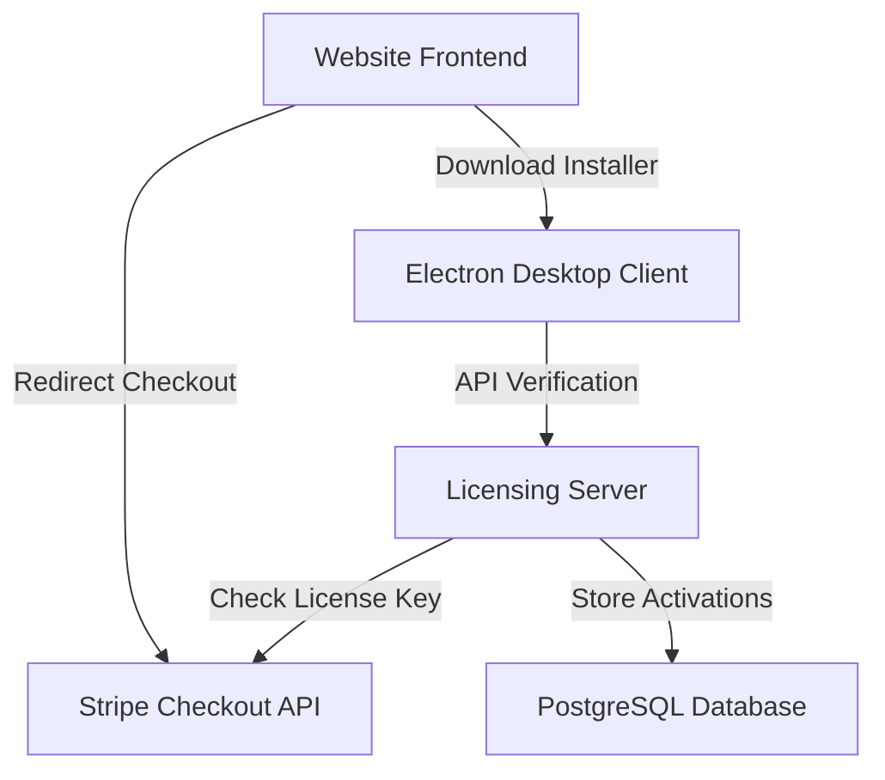

# LIDORBIT - Floating Desktop Widget & Ecosystem

LIDORBIT is a beautiful, frameless, and transparent floating desktop widget designed to prevent your laptop from sleeping when the lid is closed or idle. It features dynamic shape-morphing (Circle, Square, Rectangle), advanced safety alerts, and seamless licensing options.

---

## 🚀 Purpose & Background

### The Problem
Modern developers, AI researchers, and automation engineers frequently run long-running scripts, local LLM execution blocks, and autonomous agent loops. However, closing a laptop lid typically triggers system-level sleep, suspending all background tasks. 

While system settings can sometimes be modified, doing so is tedious, varies across OS versions, requires deep menus, and lacks smart triggers (like battery protection alerts).

### The LidOrbit Solution
LIDORBIT provides a **one-click hardware-style switch** wrapped in a premium, glassmorphic desktop widget. It keeps background terminal scripts, compile processes, and agentic loops running flawlessly even when your laptop lid is snapped completely shut. 

---

## 🛠 Technology Stack & Architecture

LIDORBIT is designed as a modular ecosystem comprised of three distinct components:



### 1. Desktop Client (Electron)
* **Shell**: Electron wrapper creating a transparent, frameless, and draggable window.
* **Logic**: Node.js APIs interacting with system power APIs.
* **UI**: Vanilla HTML5/CSS3 with modern typography (Inter), custom HSL glassmorphism, and responsive shape-morphing layouts.

### 2. Website Frontend
* **Stack**: Static HTML5, modern custom CSS stylesheets, and interactive JavaScript.
* **Visuals**: Features a real-time matrix rain background canvas, HSL-tailored colors, dynamic border glow effects, and a fully responsive structure for desktop and mobile devices.
* **Purpose**: Serves as the landing page, handling product documentation, purchases, and direct Windows application downloads.

### 3. Licensing Server
* **Stack**: Node.js, Express framework, and PostgreSQL.
* **Integrations**: Stripe API for checkout session validation and Brevo API for transactional email receipts.
* **Purpose**: Performs cryptographic validation of license keys, tracks device limits (max activations per key), and handles secure webhook events.

---

## 💎 Features & Implementation Details

### 1. Core Sleep Bypass (Keep Awake)
The primary function of LIDORBIT is to override system sleep triggers when the hardware-style toggle switch is set to **ON**. It runs a cross-platform sleep blocker with advanced platform-specific enhancements:
* **Cross-Platform Baseline**: Starts Electron's native `powerSaveBlocker` configured to prevent display sleep.
* **Windows Lid-Close & Sleep Override**:
  - Queries and backs up the user's active power scheme standby timeouts (`standby-timeout-ac` and `standby-timeout-dc`) and hibernate timeouts.
  - Temporarily sets standby and hibernate timeouts to `0` (Never sleep).
  - Unhides and overrides the Windows **Lid Close Action** setting (`5ca83367-6e45-459f-a27b-476b1d01c936`) to `0` ("Do Nothing"). This prevents the laptop from sleeping when the lid is closed.
* **macOS Caffeinate Bypass**: Spawns a detached background `caffeinate` child process using the `-i -m -s -d` flags to prevent system and display sleep.
* **Persistent Recovery Backup**: Saves the original power settings in `electron-store` before making modifications. If the application crashes, these values are automatically read and restored on the next startup.

### 2. Battery Safety Warning Alarm
LIDORBIT includes an integrated battery monitoring loop that protects your laptop from unexpected battery depletion when bypass is active:
* **Background Checker**: Runs a background loop every 10 seconds checking the battery percentage and charging status using the browser `navigator.getBattery()` API.
* **Critical Alerts (15% or Below)**: If the battery level drops to 15% or below and the charger is unplugged, the app triggers:
  - A high-frequency **double-beep** warning sound generated via the native Web Audio API (does not rely on external media files).
  - A desktop **native notification** alerting the user to plug in their power cable.
* **Custom Repeat Interval**: Users can adjust how often the alarm tone repeats (e.g. every 10 minutes) using the settings controls.
* **Interval Minimum Cap (8m)**: To ensure safety, the decrement control is capped at **8 minutes**. The app disables the minus (`−`) button at 8m and will not allow users to reduce it further.
* **Alarm Toggle**: Click the alarm clock SVG icon next to the interval buttons to enable or disable the safety checker. Swaps between `alarm_on.svg` (glows active blue) and `alarm_off.svg` (greyed out).

### 3. Draggable Frame & Moveable Overlays
The application runs as a transparent, frameless floating widget that fits seamlessly on the desktop:
* **Whole-Widget Draggability**: The window can be dragged and repositioned anywhere on the screen by clicking and holding any transparent background space.
* **Draggable settings/modal overlays**: Changed default behaviors to make the Settings overlay and License Activation modal draggable as well.
* **Click/Input Integrity**: Applied explicit `-webkit-app-region: no-drag` overrides on all buttons, checkboxes, text fields, and labels. This allows user interaction (typing keys, checking boxes, clicking buttons) while keeping the overlay background draggable.

### 4. Dynamic Morphing Shapes
Users can switch between three distinct widget presentation styles:
* **Circle**: Symmetrical `140px x 140px` circular floating widget.
* **Square**: Modern `140px x 140px` rounded square box with `16px` border radius.
* **Rectangle**: Wide `180px x 140px` rectangle format.
* **Quick Cycle Button**: Clicking the resize icon (`toggle.svg`) in the front action row cycles the shapes instantly (`Circle -> Square -> Rectangle -> Circle`).
* **Settings Selection**: Shapes can also be set directly by clicking the corresponding SVG shape buttons (`circle.svg`, `square.svg`, `rectangle.svg`) inside settings.
* **Boundary Safe Layouts**: The CSS automatically adjusts margins, widths, and paddings for each shape so that settings text and controls remain fully visible without cutting off.

### 5. Microsoft Store 7-Day Trial & Licensing
LIDORBIT is equipped with a flexible licensing and trial system:
* **MS Store 7-Day Trial**: For installs compiled with the Microsoft Store flag (`msstore`), the app automatically logs the first startup date in `electron-store`. The app is fully unlocked and functional for a **7-day free trial**.
* **Gold Status Indicator**: Shows trial progress in gold text (`Trial (7d left)`) and switches to `Trial Expired` (which locks the bypass toggle) when the 7 days are up.
* **MS Store Purchase Redirects**: Adds a row in the settings panel containing:
  - **`Trial`** button: Directs users to the Microsoft Store details page to buy the paid app version.
  - **`🛒 Purchase`** button: Directs users to the Lidorbit website to buy a license key.
* **Direct License Keys**: Direct download builds require entering a key. Connects to the licensing server API (`/api/verify`) for validation.
* **Developer Admit Key**: The key `LIDORBIT27111979XXx` is hardcoded as an offline developer key. Entering this key bypasses remote checks and instantly activates the widget.
* **Dynamic Cart Icon**: An action row cart icon (`🛒`) is displayed on both the main view and activation overlay **only when the app is unlicensed**, directing users to purchase options. It hides automatically once activated.

### 6. Licenses & Data Protection Link
* **Landing Page Access**: A document license icon (`license.svg`) is integrated at the top center of the settings panel header, right next to the settings gear icon.
* **Privacy & Terms**: Clicking the licenses icon opens the privacy policy and licenses page in the user's default browser.

### 7. Startup & Layout Preferences (LOL & AOT)
LIDORBIT provides layout configuration settings to customize behavior on the desktop:
* **Always on Top (AOT)**: Forces the widget to hover on top of all other windows at a high system level (`screen-saver` level). Can be toggled on/off.
* **Launch at Login (LOL)**: Configures system startup settings (registry path on Windows, login items on macOS) to launch the widget automatically when the computer boots up.
* **Tooltips**: Hovering the mouse over the `LOL` and `AOT` checkboxes displays descriptive hover tooltips.

### 8. Graceful Exit & System Restoration
To ensure system safety and clean up, LIDORBIT prevents system configuration leakage on quit:
* **Close Prompt**: Clicking the close button (`×`) on the front of the widget triggers a confirmation dialog asking the user if they want to exit.
* **State Restoration**: Upon exit approval, the app automatically disables the active bypass and restores original system standby, hibernate, and lid-close timeouts from the store backup.

---

## 📂 Repository Structure

```text
├── .agents/                  # Workspace configuration and instructions
├── assets/                   # Vector assets and SVG icons
├── dist/                     # Compiled binaries and installers (Excluded from Git)
├── website/                  # Landing page assets
│   ├── public/               # Main client HTML/CSS/JS source
│   └── app.yaml              # App configuration for hosting
├── licensing-server/         # Express verification server source
│   ├── public/               # Server-rendered web routes (success/login)
│   ├── server.js             # Express core routing & Stripe hooks
│   └── wasmer.toml           # Hosting runtime config
├── main.js                   # Electron main entry point
├── preload.js                # Inter-process ContextBridge exposed API
├── renderer.js               # Render process window controllers & logic
├── powerManager.js           # Low-level Windows registry & macOS caffeinate interfaces
├── safetyManager.js          # Background health & process safety checkpoints
├── style.css                 # Widget UI desktop styling rules
└── package.json              # Client npm dependencies & build scripts
```
