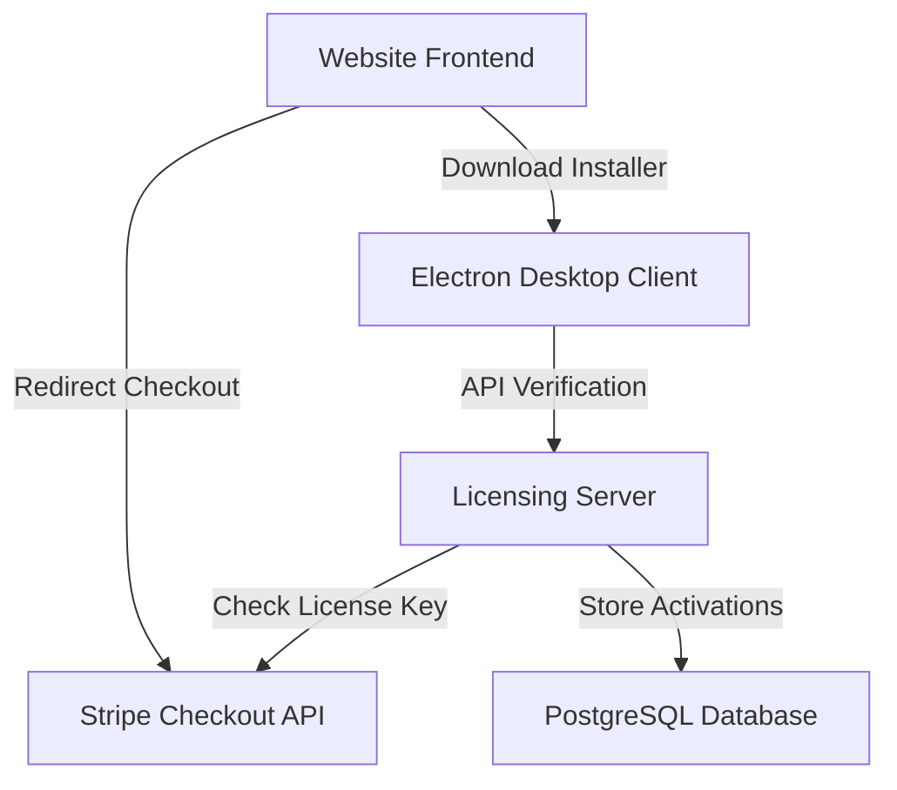

# LIDORBIT - Development History & Workspace Memory

This document stores the complete development history, configuration, and architecture state of the **LidOrbit** project. It serves as a persistent memory checkpoint for future development sessions.

---

## 📅 Project History & Milestones (To Date)

1. **Core Features Verification**:
   * Blocking system sleep and hibernate on lid-close (via Windows Registry overrides and macOS `caffeinate` commands).
   * Battery monitoring loop (10-second checks) triggers double-beep alerts and desktop notifications if unplugged at or below 15% battery. Cap alert decrement at 8 minutes.
   * Frame morphing (Circle 140x140, Square 140x140, Rectangle 180x140) and click-region overrides (`-webkit-app-region: no-drag`) to keep settings input elements usable while keeping the widget frame draggable.

2. **Licensing & Authentication Setup**:
   * Connected licensing backend to an Aiven PostgreSQL database instance.
   * Integrated Stripe API to retrieve Checkout Session IDs and confirm payment status.
   * Integrated Brevo SMTP API to send transactional emails (Welcome/License mail, Password Reset mail).
   * Seeded test user credentials in PostgreSQL:
     * **Username**: `lidorbituser`
     * **Email**: `user@lidorbit.com`
     * **Password**: `Password123!`
     * **Stripe License Key**: `cs_test_LIDORBIT_TEST_LICENSE` (linked automatically for offline/mock sandbox testing).

3. **Ecosystem Structuring & Git Setup**:
   * Set up a root `.gitignore` file to ignore sensitive key files (`LidOrbitAPIKEY.txt`, `.env` files) and built binary artifacts (`dist/`, `release/`, `build/`, `installer/extraResources/`).
   * Initialized Git local repository, created the first clean commit, and pushed the codebase to the public GitHub repository.
   * Tagged release `v1.0.0` on GitHub and uploaded the compiled desktop setup installer `LIDORBIT.Setup.1.0.0.exe` (~80.9 MB) as the official download asset.
   * Updated the homepages of the static website and licensing server to point the Windows download buttons directly to the GitHub release asset URL.

4. **Showcase Video Integration**:
   * Embedded the YouTube Short video `https://youtube.com/shorts/4N0SNSXoGO8` into the "Watch it flex in real time" section of the main landing pages.
   * Configured the iframe to autoplay, run muted, loop, and display player controls (`controls=1`) so users can adjust volume and listen to the audio track.

5. **Cloud Deployment (Wasmer Edge)**:
   * **Website Frontend**: Hosted at `https://www.lidorbit.com` (Wasmer App ID: `da_K53IxtPU6Wd7`).
   * **Licensing Server API**: Hosted at `https://lidorbit-api.wasmer.app` (Wasmer App ID: `da_RxJIdtAUEdrW`).
   * Both applications were successfully built remotely and deployed via Wasmer CLI (`wasmer app deploy --build-remote`).

6. **SEO Optimization & Content Pages**:
   * Created three highly optimized, mobile-friendly SEO pages:
     * `/vs-amphetamine` ([vs-amphetamine.html](file:///c:/Users/fahdz/Desktop/KEEPITUP/website/public/vs-amphetamine.html)) - Sid-by-side comparison with Amphetamine.
     * `/keep-mac-awake-lid-closed-ai-agents` ([keep-mac-awake-lid-closed-ai-agents.html](file:///c:/Users/fahdz/Desktop/KEEPITUP/website/public/keep-mac-awake-lid-closed-ai-agents.html)) - Comprehensive clamshell keep-awake instructions.
     * `/best-keep-awake-app-2026` ([best-keep-awake-app-2026.html](file:///c:/Users/fahdz/Desktop/KEEPITUP/website/public/best-keep-awake-app-2026.html)) - Top 5 keep-awake apps comparison and roundup.
   * Wrote JSON-LD Schema (FAQ and Article markup) for Google crawl bots.
   * Integrated internal link network connecting all pages, footers, and homepages.

7. **macOS Build & Actions Pipeline**:
   * Configured a GitHub Actions workflow `.github/workflows/build.yml` executing on both `macos-latest` and `windows-latest` runners.
   * Compiles the desktop app natively for macOS (generating `LIDORBIT-1.0.0-arm64.dmg`) and Windows (generating `LIDORBIT.Setup.1.0.0.exe`), automatically uploading them to GitHub Releases.
   * Replaced Mac App Store links with direct download links pointing to the compiled `LIDORBIT-1.0.0-arm64.dmg` release asset.

---

## 🛠 Technology Stack & Component Architecture



### 1. Desktop Client (Electron)
* **Main Files**:
  * [main.js](file:///c:/Users/fahdz/Desktop/KEEPITUP/main.js): Window creation, IPC main handlers, and power manager integration.
  * [preload.js](file:///c:/Users/fahdz/Desktop/KEEPITUP/preload.js): Context bridge exposing methods to the renderer.
  * [renderer.js](file:///c:/Users/fahdz/Desktop/KEEPITUP/renderer.js): Front-end UI styling hooks, battery monitoring, and IPC triggers.
  * [powerManager.js](file:///c:/Users/fahdz/Desktop/KEEPITUP/powerManager.js): System standby, hibernate, and lid-closed action overrides.
  * [safetyManager.js](file:///c:/Users/fahdz/Desktop/KEEPITUP/safetyManager.js): Background process checks and checkpoints.
  * [licenseService.js](file:///c:/Users/fahdz/Desktop/KEEPITUP/licenseService.js): Handles communication with the licensing server, offline token caching, and safekeeping.

### 2. Website Frontend
* **Folder**: [website/public/](file:///c:/Users/fahdz/Desktop/KEEPITUP/website/public)
* **Index**: [index.html](file:///c:/Users/fahdz/Desktop/KEEPITUP/website/public/index.html) - Main landing page.
* **SEO Pages**:
  * [vs-amphetamine.html](file:///c:/Users/fahdz/Desktop/KEEPITUP/website/public/vs-amphetamine.html) - Comparison guide.
  * [keep-mac-awake-lid-closed-ai-agents.html](file:///c:/Users/fahdz/Desktop/KEEPITUP/website/public/keep-mac-awake-lid-closed-ai-agents.html) - How-to guide.
  * [best-keep-awake-app-2026.html](file:///c:/Users/fahdz/Desktop/KEEPITUP/website/public/best-keep-awake-app-2026.html) - Roundup.
* **Wasmer App Config**: [website/app.yaml](file:///c:/Users/fahdz/Desktop/KEEPITUP/website/app.yaml)

### 3. Licensing Server Backend
* **Folder**: [licensing-server/](file:///c:/Users/fahdz/Desktop/KEEPITUP/licensing-server)
* **Server**: [server.js](file:///c:/Users/fahdz/Desktop/KEEPITUP/licensing-server/server.js) - Express routes.
* **Database**: [database.js](file:///c:/Users/fahdz/Desktop/KEEPITUP/licensing-server/database.js) - PostgreSQL pool connections.
* **Emails**: [emailService.js](file:///c:/Users/fahdz/Desktop/KEEPITUP/licensing-server/emailService.js) - Brevo SMTP calls.
* **SEO Pages**:
  * [vs-amphetamine.html](file:///c:/Users/fahdz/Desktop/KEEPITUP/licensing-server/public/vs-amphetamine.html) - Comparison guide.
  * [keep-mac-awake-lid-closed-ai-agents.html](file:///c:/Users/fahdz/Desktop/KEEPITUP/licensing-server/public/keep-mac-awake-lid-closed-ai-agents.html) - How-to guide.
  * [best-keep-awake-app-2026.html](file:///c:/Users/fahdz/Desktop/KEEPITUP/licensing-server/public/best-keep-awake-app-2026.html) - Roundup.
* **Wasmer App Config**: [licensing-server/app.yaml](file:///c:/Users/fahdz/Desktop/KEEPITUP/licensing-server/app.yaml)

---

## 🔑 Stripe & License Handshake Flow

1. **Purchase**: The user purchases a lifetime LidOrbit license on Stripe via our Pricing checkout link.
2. **Redirect & Session ID**: Stripe redirects the successful transaction to `/success.html?session_id=cs_...`.
3. **Registration**: 
   * The website checks if the user is logged in. If not, it redirects them to `/register.html?session_id=cs_...`.
   * The user fills in registration info. The backend retrieves the Stripe session using the ID (`licenseKey`) and verifies it is paid.
   * The backend registers the user in PostgreSQL and stores the Stripe `cs_...` ID as the `license_key`.
4. **App Activation**:
   * The user logs in inside the Electron app using their credentials, OR clicks "Activate by Key" and pastes their `cs_...` Stripe session key.
   * The backend validates the credentials or key, registers their local `machineId` (limits to `MAX_DEVICES = 1`), and returns a signed 72-hour JWT token.
   * The client stores the license status and token locally to enable offline usage during the grace period.

---

## 🚀 Commands for Deployment & Dev

* **Run Electron App (Dev)**:
  ```powershell
  npm start
  ```
* **Compile Clean Release Binaries**:
  ```powershell
  npm run dist
  ```
* **Deploy Frontend to Wasmer**:
  ```powershell
  cd website
  wasmer app deploy --build-remote
  ```
* **Deploy Licensing Server to Wasmer**:
  ```powershell
  cd licensing-server
  wasmer app deploy --build-remote
  ```
* **Check deployed app status**:
  ```powershell
  wasmer app list
  ```
